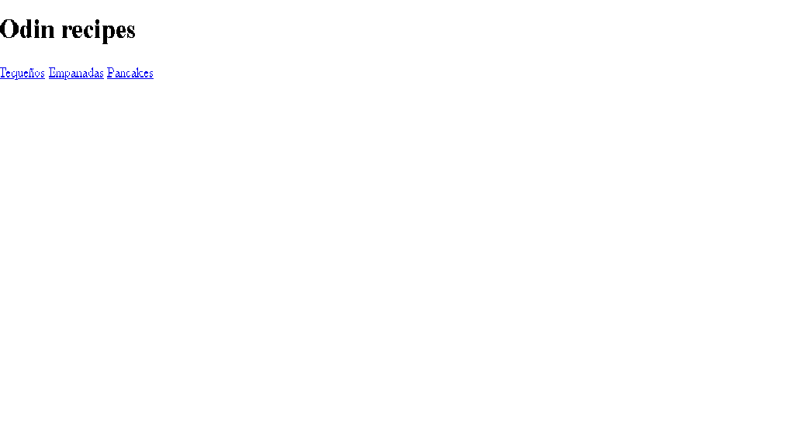

0

#OdinRecipes

> For those who don't know how to cook cupcakes or tequeños and pancakes, here is the hack of life

What you will see below is everything necessary to be able to cook what a Tequeño empanada and pancake is.

## Built with

- html
- VSCode
- Git Bash

## Live Demo

[Live Demo Link](https://abrahm18.github.io/odin-recipes/)

## Starting

**This work is from 3 repositories about fast food, as it is super detailed step by step and it will definitely help you a little if you don't know how to cook**

To get a local copy up and running, follow these simple example steps.

### Previous requirements

### Setting

### Install

### Use

### Run tests

### Implementation

## Authors

👤 **Abraham Nazareth Hidalgo Sanoja**

- GitHub: [@abrahm18](https://github.com/abrahm18)

## 🤝 Contributing

Contributions, issues, and feature requests are welcome!

Feel free to check out the [issues page](https://github.com/Abrahm18/odin-recipes/issues).

## Show your support

Give it a ⭐️ if you like this project!

## Thanks

- I thank Google for giving me the information I needed to carry out this project.
- I thank my partner Daniel who helped me complete my project and for teaching me some tricks

## 📝 License

This project is [CC0 1.0 Universal](LICENSE) licensed.
